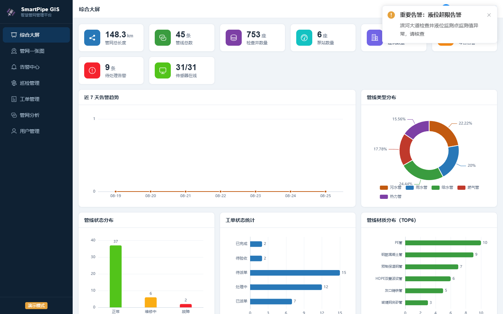
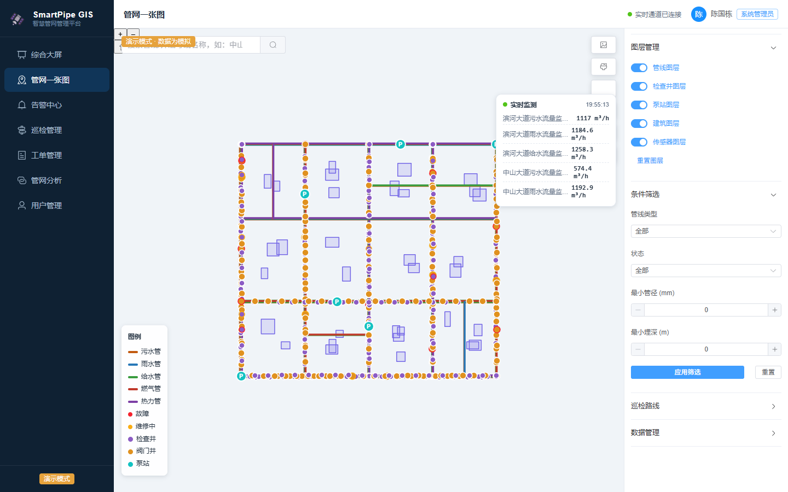
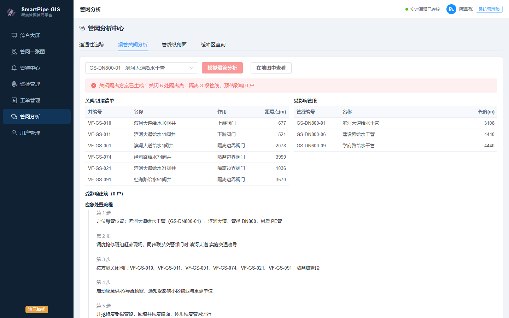
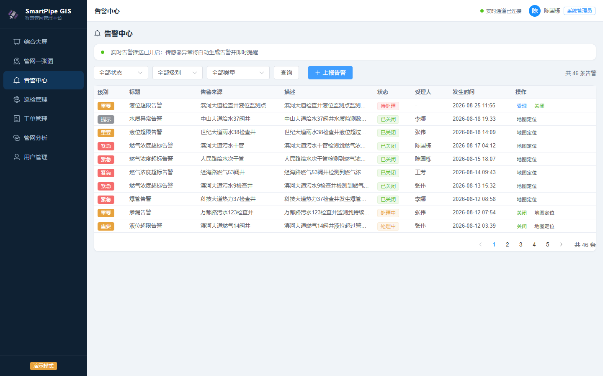

# 🛰️ SmartPipe GIS 智慧城市地下管网管理平台

> 一个**可运行、可部署**的 WebGIS 全栈项目：前端 Vue3 + OpenLayers + ECharts，后端 Node.js + Express + SQLite + WebSocket。模拟真实管网普查数据与业务场景。**前端强依赖后端**——后端服务不可用时前端直接拦截提示，确保数据完整性与业务一致性。

[](https://vuejs.org)
[](https://openlayers.org)
[](https://nodejs.org)
[](deploy/DEPLOY.md)

## 📌 项目简介

以"滨江市·高新开发区"（虚构）为案例区域，模拟一个区级地下管网管理平台的完整业务闭环：
管网普查数据入库 → 一张图可视化 → 实时传感监测 → 异常告警 → 工单调度 → 巡检养护 → 应急处置（爆管关阀分析）。

**数据规模**：45 条管线（148 km）、753 座井（含交叉口共享节点）、6 座泵站、33 栋建筑、31 个在线传感器、45 条历史告警、38 张工单、5 个巡检计划——由确定性种子随机生成器产生，**前后端数据完全同源**。

## 🖼️ 界面预览

| 综合大屏 | 管网一张图 |
|---|---|
|  |  |
| **爆管关阀分析** | **告警中心** |
|  |  |

## ✨ 功能总览

| 模块 | 功能 |
|---|---|
| 🔐 认证与权限 | JWT 登录，4 级角色（管理员/调度员/巡检员/浏览用户），接口级权限控制 |
| 📊 综合大屏 | 管网总览 KPI、告警趋势、类型/状态/材质统计、实时监测曲线（1h/6h/24h） |
| 🗺️ 管网一张图 | 天地图底图（矢量/影像）、图层管理、条件筛选、搜索定位、专题图（管径/埋深/年代/材质分级）、量测工具、多边形选择、GeoJSON 导入导出、要素在线编辑 |
| 📡 实时监测 | 31 个传感器 3s 级遥测推送（WebSocket），液位/流量/压力/燃气泄漏，异常自动告警弹窗 |
| 🚨 告警中心 | 7 类告警（爆管/渗漏/液位超限/燃气超标…）、受理→关闭处置流程、地图定位 |
| 🎫 工单管理 | 抢修/维修/保养/巡检/投诉工单，五状态流转（待派单→已派单→处理中→待验收→已完成） |
| 🚶 巡检管理 | 巡检计划、路线点位、开始/上报/完成，发现问题自动生成告警 |
| 🧭 管网分析 | **连通性追踪**（上下游）、**爆管关阀分析**（隔离方案/影响户数/处置流程）、**管线纵剖面**、**缓冲区查询** |
| 👥 用户管理 | 账号增删改、角色分配、密码重置（管理员） |

## 🏗️ 架构设计

```
┌────────────────────────── 前端（Vue3 + OpenLayers + ECharts + Element Plus）──────────────┐
│ 登录 / 综合大屏 / 一张图 / 告警中心 / 巡检管理 / 工单管理 / 管网分析 / 用户管理              │
│  启动前置校验：探测 /api/overview/health，后端不可用 → 拦截错误页（不进入应用）            │
└──────────────┬───────────────────────────────────────────────────────────────┘
               │ REST + JWT            WebSocket（遥测/告警推送）
┌──────────────▼───────────────────────────────────────────────────────────────┐
│                    后端（Node.js + Express + sql.js + JWT + ws）                │
│  要素 CRUD · 空间分析（缓冲/追踪/爆管关阀/剖面）· 告警工单流程 · 遥测模拟器        │
│  SQLite（WASM 内存引擎 + 周期落盘，零原生依赖，任何环境 npm install 即可运行）     │
└───────────────────────────────────────────────────────────────────────────────┘
```

**核心设计**：
- **前端强依赖后端**：应用启动前探测后端健康检查，不可用时显示明确错误页并支持重试，杜绝"无声降级"造成的数据不一致；
- **确定性模拟数据**：`scripts/generate-mock-data.mjs` 用固定种子生成可重复的模拟普查数据（管线/井/泵站/建筑/告警/工单/巡检），后端首次启动自动入库；
- **真实拓扑**：管线-井-管线拓扑网络（道路交叉口共享井），支撑连通性追踪与爆管关阀分析等经典管网 GIS 功能。

## 🚀 快速开始

```bash
# 1. 安装依赖（前端 + 后端）
npm install
cd server && npm install && cd ..

# 2. 生成模拟数据（前后端共用，固定种子可重复生成）
npm run gen:data

# 3. 终端 A：启动后端（首次启动自动建库导入种子数据，含实时遥测模拟器）
npm start
# → API: http://localhost:8080/api

# 4. 终端 B：启动前端开发服务器
npm run dev
# → http://localhost:5173 （vite 已配置 /api 代理到 8080，自动进入在线模式）
```

> 注意：后端与前端需分别在**两个终端**中运行（都是常驻进程）。
> 前端启动时强制探测后端：后端未启动时页面显示"无法启动"错误页，需先启动后端。

**演示账号**：`admin/admin123`（管理员）· `zhangwei/zhang123`（调度员）· `lina/lina123`（巡检员）· `wangfang/wang123`（只读）

## ☁️ 部署到虚拟机

三种方式任选，详见 [deploy/DEPLOY.md](deploy/DEPLOY.md)：

| 方式 | 命令 | 说明 |
|---|---|---|
| 一键脚本 | `sudo bash deploy/deploy.sh` | Ubuntu/Debian：自动构建前端 + nginx + systemd |
| Docker | `docker compose -f deploy/docker-compose.yml up -d --build` | 单容器全栈，数据卷持久化 |
| 手动分步 | 见部署文档 | nginx 反代 + systemd 守护，生产可控性最强 |

## 🌐 GitHub Pages（需配合后端）

本项目前端强依赖后端，GitHub Pages 静态托管仅作为前端资源分发，**必须搭配可访问的后端服务**：

1. 后端部署在任意可公网访问的服务器（VM/Docker，见上节），并开启 CORS（默认已开启）；
2. 构建前端时指定后端地址：

```bash
VITE_API_BASE=https://your-server:8080/api npm run build
```

3. 将 `docs/` 目录作为 GitHub Pages 发布源。

## 📁 项目结构

```
webTest/
├── src/                     # 前端源码（纯后端模式，启动前置健康检查）
│   ├── api/                 # API 层：http 封装 / 统一服务接口
│   ├── store/               # 状态管理（认证 / 应用实时状态）
│   ├── views/               # 页面：登录/大屏/一张图/告警/巡检/工单/分析/用户
│   └── components/map/      # 地图组件：要素编辑抽屉 / 分析结果面板
├── server/                  # 后端服务（Node + Express + sql.js）
│   ├── src/                 # 入口 / 数据库 / 认证 / 空间分析 / 遥测模拟器 / 路由
│   └── data/                # 种子数据 + SQLite 落盘文件
├── scripts/                 # 模拟数据生成器（固定种子）/ e2e 测试 / 静态服务器
├── deploy/                  # Dockerfile / compose / nginx / systemd / 部署脚本 / 部署文档
├── design/                  # 方案设计文档 / API 文档 / 演示指南
└── docs/                    # Vite 构建产物（静态部署源）
```

## 📚 文档

- [部署指南](deploy/DEPLOY.md) — 虚拟机部署（脚本/Docker/手动）
- [方案设计文档](design/DESIGN.md) — 需求分析、总体架构、数据库设计、API 契约、关键算法
- [API 文档](design/API.md) — 全部 REST 接口与 WebSocket 协议
- [演示指南](design/DEMO_GUIDE.md) — 10 分钟演示路径（适合面试/汇报场景）

## 📄 简历描述建议

**项目名称**：智慧城市地下管网管理平台（SmartPipe GIS）

**职责描述**：
- 基于 Vue3 + OpenLayers + ECharts 构建管网一张图，支持图层管理、专题图、量测与要素在线编辑
- 设计并实现 Node.js + Express + SQLite 后端服务，JWT 认证与四角色权限体系，REST + WebSocket 双通道
- 实现经典管网 GIS 空间分析：上下游连通追踪、爆管关阀隔离方案、管线纵剖面、缓冲区查询
- 设计确定性模拟数据生成器，产出 45 条管线/753 座井的真实拓扑管网，前后端数据同源
- 搭建实时遥测模拟器：31 个传感器 3s 级推送、异常注入与告警自动生成，打通"监测-告警-工单-处置"业务闭环
- 前端强依赖后端架构：启动前置健康检查与错误拦截，交付 Docker/Nginx/systemd 三种部署方案与完整部署文档

**技术栈**：Vue3、TypeScript、OpenLayers、ECharts、Element Plus、Node.js、Express、SQLite、WebSocket、JWT、Docker、Nginx

## ⚠️ 声明

本项目为**教学与产品演示用途**的模拟系统：案例区域（滨江市·高新开发区）为虚构设计，全部数据由确定性随机算法生成，不代表任何真实行政区划或管网现状。
